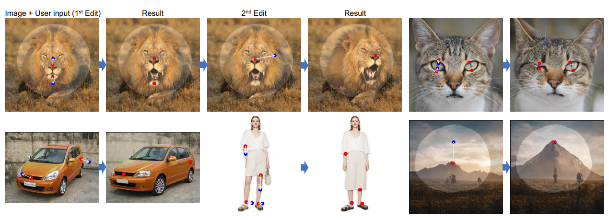

# Unofficial implementation of the paper "Drag Your GAN: Interactive Point based Manipulation on the Generative Image Manifold"

[:sparkles: Try on Colab!](https://colab.research.google.com/github/adriaciurana/DragGAN/blob/master/colab_notebook.ipynb) 

### [[Official repository]](https://github.com/XingangPan/DragGAN) Drag Your GAN: Interactive Point-based Manipulation on the Generative Image Manifold
> Xingang Pan, Ayush Tewari, Thomas Leimkühler, Lingjie Liu, Abhimitra Meka, Christian Theobalt<br>
> *SIGGRAPH 2023 Conference Proceedings*



Synthesizing visual content that meets users' needs often requires flexible and precise controllability of the pose, shape, expression, and layout of the generated objects. Existing approaches gain controllability of generative adversarial networks (GANs) via manually annotated training data or a prior 3D model, which often lack flexibility, precision, and generality. In this work, we study a powerful yet much less explored way of controlling GANs, that is, to "drag" any points of the image to precisely reach target points in a user-interactive manner, as shown in Fig.1. To achieve this, we propose DragGAN, which consists of two main components: 1) a feature-based motion supervision that drives the handle point to move towards the target position, and 2) a new point tracking approach that leverages the discriminative generator features to keep localizing the position of the handle points. Through DragGAN, anyone can deform an image with precise control over where pixels go, thus manipulating the pose, shape, expression, and layout of diverse categories such as animals, cars, humans, landscapes, etc. As these manipulations are performed on the learned generative image manifold of a GAN, they tend to produce realistic outputs even for challenging scenarios such as hallucinating occluded content and deforming shapes that consistently follow the object's rigidity. Both qualitative and quantitative comparisons demonstrate the advantage of DragGAN over prior approaches in the tasks of image manipulation and point tracking. We also showcase the manipulation of real images through GAN inversion.

# TODO
- [x] Create docker for CPU and GPU.
- [ ] Improve code quality.
- [ ] Create docstring.
- [ ] Improve gradio app.
- [ ] Generalize for other models.


# Install
This implementation of DragGAN works with the official version of styleganv2-ada in pytorch. To properly clone the repository please use the `--recurse-submodules` flag:

```
git clone --recurse-submodules https://github.com/adriaciurana/DragGAN.git
```

You can install the requirements using the following command:
```
pip install -r requirements.txt
```

I suggest to install pytorch separately with the CUDA version that you need.

# Implementation
In the file drag_gan.py you will find the entire implementation of the paper. The implementation is efficient (only uses pytorch).

Use pytorch hooks that allow flexibility for future styleganv2 networks. From the constructor you must define which layers you want to use for the DragGAN (it would also be possible to change to another architecture with few changes).

# GUI


Additionally, a GUI has been created to be able to apply the paper to images.
```
python gradio_app.py
```

# Citation
```
@inproceedings{pan2023draggan,
    title={Drag Your GAN: Interactive Point-based Manipulation on the Generative Image Manifold}, 
    author={Pan, Xingang and Tewari, Ayush, and Leimk{\"u}hler, Thomas and Liu, Lingjie and Meka, Abhimitra and Theobalt, Christian},
    booktitle = {ACM SIGGRAPH 2023 Conference Proceedings},
    year={2023}
}
```

# Contributions
I'm glad you want to contribute and improve the code :)
I'm not an expert in Gradio, so any suggestion is welcome.

